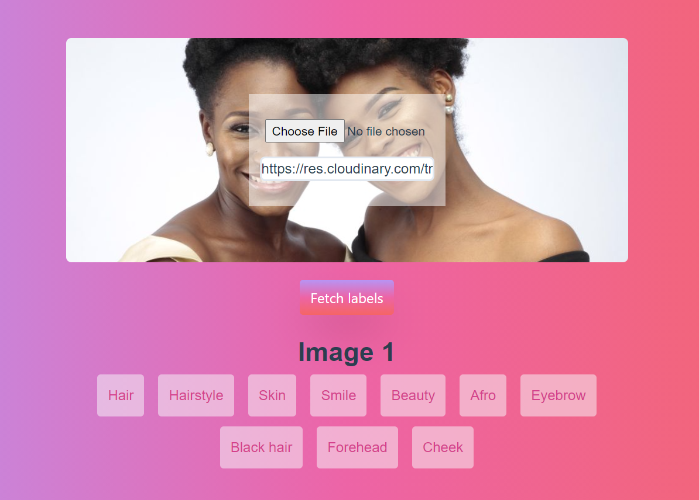

# Vision: Label images with Google Vision API
> A simple Vue 3 CLI app to label uploaded images or images on the web with the Google Vision API.

[](https://app.netlify.com/sites/vision-app/deploys)

## Detect Labels for multiple images
> Using the helpful Cloudinary upload widget, you can upload and label multiple images from various sources such as your local computer, google drive, Facebook, Instagram and any image hosted on a CDN.


## Label a single image on the web

> Image: [Omai Essentials](https://www.instagram.com/omai.essentials/?hl=en)

## Run this project locally
To run this project locally, [clone this repo](https://github.com/goodhands/vision-app) and run the commands belows. Copy over the contents of `.env.local.example` to `.env.local` or run `cp .env.local.example .env.local` and replace the credentials with the one gotten from Google APIs and Cloudinary.

## Project setup
```
npm install
```

### Compiles and hot-reloads for development
```
npm run serve
```

### Compiles and minifies for production
```
npm run build
```

### Lints and fixes files
```
npm run lint
```

### Developer
This application was written by [Samuel Olaegbe](https://twitter.com/devloader).
